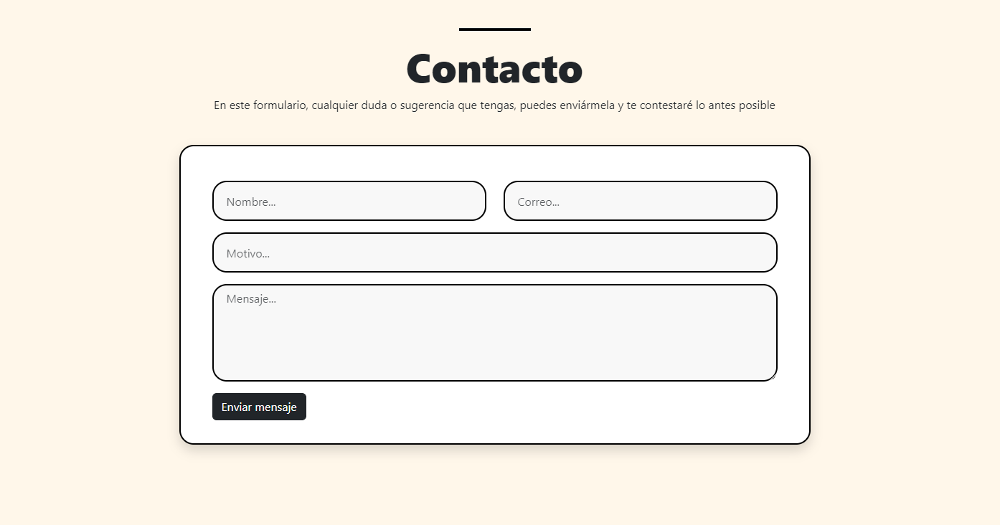
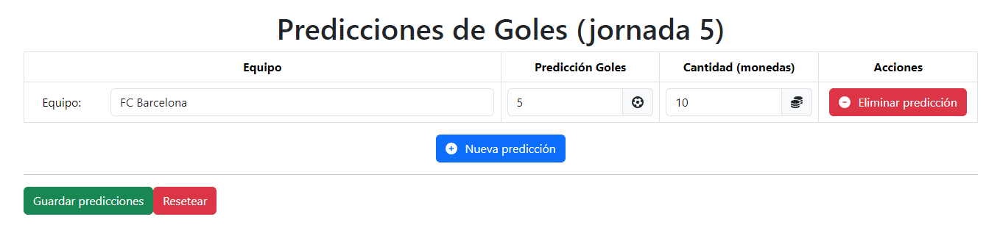

# FullStack TFG Project (MEAN Stack)

Proyecto creado y desarrollado para el TFG de la carrera de Ingeniería Informática.

## Tabla de Contenidos
1. Descripción
2. Ejecución del Proyecto
3. Tecnologías Usadas
4. Capturas del Proyecto

## Descripción

El proyecto consiste en una página web relacionada con la primera división de fútbol donde puedes ver toda la información acerca de los resultados de los partidos, los máximos goleadores, asistentes... Aparte,  también existe una moneda con la que los usuarios registrados si aciertan predicciones, podrán ir ganando más monedas para poder canjearlos por increíbles premios.

La aplicación tiene 3 diferentes versiones: 

- **NoLogin**:  puede ver toda la información de la liga española (ranking, equipos, jugadores…), pero no puede conseguir premios, porque tiene que loguearse para ello.

- **Usuario**: puede ver toda la información, puede hacer predicciones y canjear premios.

- **Administrador**: puede gestionar a todos los usuarios de la página (crear, ver, borrar o editar), puede simular la siguiente jornada de la liga, puede ver los mensajes que han dejado los usuarios y puede gestionar los premios disponibles de la web. 

## Ejecución del proyecto

Comando para el Frontend (Angular): 

```sh
ng s -o
```

Comando para el Backend (NodeJs): 

```sh
npm start
```

## Tecnologías Usadas

### - Node JS + Express

Conocer esta nueva tecnología para el desarrollo de un servidor y de rutas API Rest personalizadas.

### - Mongoose (Mongo DB)

Base de Datos no relacional que encaja con Node y Express

### - Angular v 15.2

FrontEnd para vistas dinámicas y conexión con el server de Node

## Capturas del proyecto

### Página Principal (Pública) 
Landing page (imágenes con Lazy Loading) dividida en 4 secciones: 

- **Inicio**

- **Secciones**

- **Sobre Mí**

- **Contacto**


### Novedades (Pública)
A partir de la jornada 2, aparece esta sección en el menú. Carrousel con estas 3 opciones: 
- **Equipo** que más goles ha metido en la última jornada
- **Goleador** que más goles ha hecho en la última jornada
- **Asistente** que más asistencias ha dado en la última jornada


### Clasificación (Pública)
4 opciones tiene esta sección del menú: 
- **Tabla de Clasificación** (por defecto): tabla de la posición de cada equipo en la liga con sus diferentes estadísticas

- **Jornada**: resumen de los resultados de la jornada. 

Si pinchas en el resultado de un partido ya jugado, aparece esta pantalla: 


- **Goleadores y Asistentes**: tabla con los 10 máximos goleadores y asistentes de toda la liga.


### Colección (Pública)
Página con los 20 equipos de primera división

Si pinchas en uno de ellos, puedes ver sus jugadores y su entrenador:


### Premios (Pública)
Todos los premios disponibles

Si el usuario está logueado y tiene monedas, le aparece esta pantalla:


### Predicciones (Privada - Usuario)
Página que tiene 4 opciones para realizar predicciones y ganar monedas: 

- **Quniela**: acertar los equipos ganadores de la jornada

- **Predi Goles**: acertar los goles de un equipo en la siguiente jornada

- **Predi Asistencias**: acertar las asistencias de un equipo en la siguiente jornada

- **Histórico**: ver el resumen de tus predicciones de las últimas jornadas

## Dashboard del Administrador
Rol de administrador que sirve para gestionar la página web. 
### Gestionar Usuarios - CRUD (Privada - Administrador)

Puede ver, añadir, editar y borrar usuarios.
### Jornadas (Privada - Administrador)

Puede simular la siguiente jornada de la liga, o empezar de 0 la liga.
### Buzón de Mensajería (Privada - Administrador)
Ver los mensajes de los usuarios dando feedback para poder mejorar la página wb

### Gestionar Premios - CRUD (Privada - Administrador)
Puede ver, añadir, editar y borrar premios.
